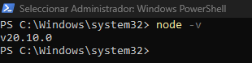

# UniqueStyle

## Backend
   Se realiza en Node.JS version 20.`

   

```C#


// Crear proyecto
npm init -y

// Instalar paquete node_modules (necesario para que funcione el proyecto)
npm install

// Instalar paquete de express
npm install express 

// Instalar paquete de cors (politicas de seguridad)
npm install cors

// Instalar paquete de firebase
npm install firebase-admin

// Instalar paquete de swagger
npm install swagger-ui-express

// Instalar generador token JWT
npm install jsonwebtoken

// Instalar para leer archivos .env
npm install dotenv

// Instalar para encriptar claves
npm install bcrypt


```